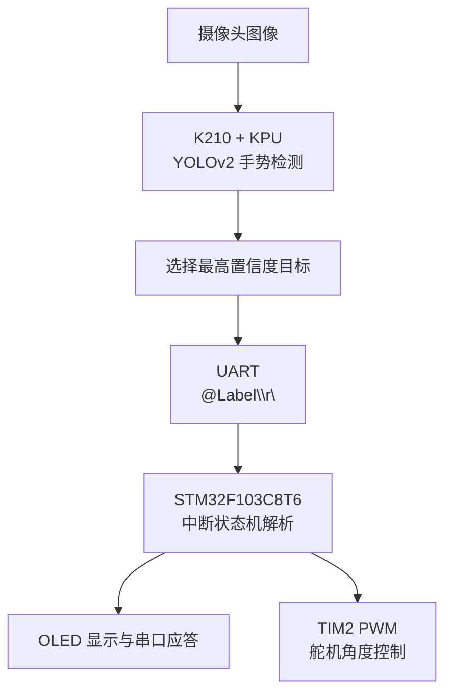

# K210 + STM32 手势识别舵机控制系统

> K210 完成五类手势目标检测，STM32F103C8T6 通过串口接收识别结果并控制舵机，实现“视觉识别—指令传输—单片机解析—执行反馈”的双主控系统。

## 项目概述

系统采用 K210 作为视觉感知端，运行 MaixPy 与 KPU 手势模型；STM32F103C8T6 作为执行控制端，负责串口协议解析、OLED 状态显示以及舵机 PWM 输出。

支持的五类手势为：

| 模型标签 | 含义 |
|---|---|
| `Five` | 五指张开 |
| `Zero` | 数字 0 |
| `Yeah` | V/Yeah 手势 |
| `Close` | 握拳 |
| `One` | 数字 1 |

K210 只在识别标签发生变化时发送新指令，减少重复串口通信。STM32 每收到一个有效手势，舵机目标角度增加 30°，超过 180°后回到 0°。

## 系统架构



## 核心功能

- K210 摄像头实时采集与 LCD 预览
- KPU 加载 `.kmodel` 并运行 YOLOv2
- 识别框、标签、置信度与推理耗时显示
- 最佳目标选择与重复消息抑制
- `@MSG\r\n` ASCII 串口协议
- STM32 USART1 中断接收状态机
- OLED 显示接收指令和应答结果
- TIM2 CH2 输出 50 Hz 舵机 PWM

## 硬件组成

| 模块 | 作用 |
|---|---|
| K210 开发板及摄像头 | 手势检测 |
| LCD | 显示识别画面 |
| STM32F103C8T6 | 指令解析和执行控制 |
| 舵机 | 执行动作 |
| OLED | 显示接收状态 |
| 3.3 V TTL 串口链路 | 双主控通信 |

## 最小接线

| K210 | STM32F103C8T6 | 说明 |
|---|---|---|
| IO10 / UART1_TX | PA10 / USART1_RX | K210 发送标签 |
| IO11 / UART1_RX | PA9 / USART1_TX | STM32 回传应答，可选 |
| GND | GND | 必须共地 |

STM32 外设：

| STM32 引脚 | 外设 |
|---|---|
| PA1 / TIM2_CH2 | 舵机信号 |
| OLED 驱动定义 | 以 `stm32/Hardware/OLED.c` 为准 |

> 两端必须使用 3.3 V TTL 串口。舵机应使用满足其电流要求的独立电源，并与 STM32 共地，不能直接由 MCU 引脚供电。

完整说明见 [项目技术指南](docs/PROJECT_GUIDE.md)。

## 串口协议

K210 发送：

```text
@Five\r\n
@Zero\r\n
@Yeah\r\n
@Close\r\n
@One\r\n
```

STM32 应答：

```text
Five_OK\r\n
ERROR_COMMAND\r\n
```

串口参数：`115200 bit/s`、`8 data bits`、`no parity`、`1 stop bit`。

## 快速开始

### K210

1. 将 `K210-5个手势模型/main.py` 与 `model-256131.kmodel` 放入 TF 卡对应目录；
2. 使用支持当前 API 的 MaixPy 固件；
3. 确认模型路径为 `/sd/model-256131.kmodel`；
4. 运行 `main.py`，观察 LCD 上的识别框和标签。

### STM32

1. 使用 Keil MDK 打开 `stm32/Project.uvprojx`；
2. 确认目标器件为 STM32F103C8；
3. 编译并通过 ST-Link/J-Link 烧录；
4. 连接 OLED、舵机和串口；
5. 上电后观察 OLED 接收内容及舵机动作。

## 仓库结构

```text
├── K210-5个手势模型/
│   ├── main.py                  # K210 推理与通信
│   ├── model-256131.kmodel      # 五手势模型
│   └── report.json              # 模型报告
├── stm32/
│   ├── User/main.c              # 业务逻辑
│   ├── Hardware/Serial.c        # 串口协议状态机
│   ├── Hardware/Servo.c         # 角度到脉宽映射
│   ├── Hardware/PWM.c           # TIM2_CH2 PWM
│   └── Project.uvprojx          # Keil 工程
├── 硬件连接.docx
└── docs/PROJECT_GUIDE.md
```

## 当前实现说明

- KPU 检测阈值为 `0.5`，NMS 阈值为 `0.3`；
- K210 只发送当前帧中置信度最高的目标；
- 同一标签连续出现时不重复发送；
- 每种有效手势当前执行相同动作：舵机角度增加 30°；
- 若希望五种手势对应五个固定角度，可在 `main.c` 中分别设置 `Angle`。

## 安全与限制

- 调试舵机前先拆除机械负载或限制运动范围；
- 模型文件必须与 `labels` 和 `anchors` 一致；
- 当前协议没有校验和、序号和通信超时；
- 当前只在“标签变化”时发送，识别丢失后再次识别同一标签不会自动重发，除非中间识别到其他标签或重启程序；
- 仓库未提供模型数据集和训练脚本，模型精度需要在实际环境中验证。

## License

仓库当前未声明开源许可证。未经作者明确授权，默认保留全部权利。
