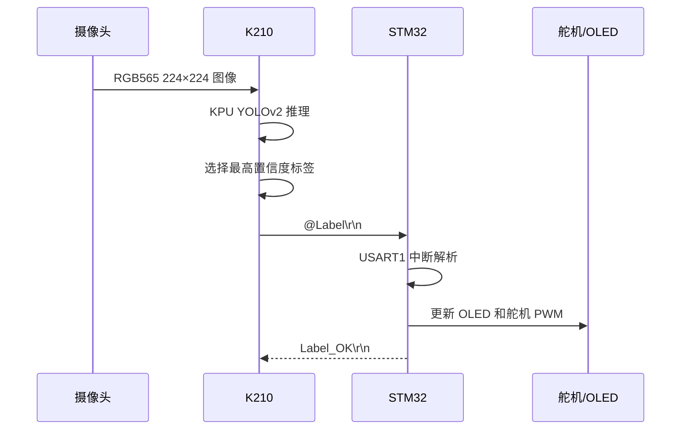

# 项目技术指南

## 1. 执行流程

## 2. K210 代码

入口为 `K210-5个手势模型/main.py`：

1. 初始化摄像头、LCD 与 UART1；
2. 从 TF 卡加载 `/sd/model-256131.kmodel`；
3. 使用 `kpu.run_yolo2()` 完成检测；
4. 绘制目标框、标签、置信度和耗时；
5. 从多个目标中选择置信度最高者；
6. 按 `@标签\r\n` 发送，仅在标签变化时发送。

模型输入尺寸为 224×224，标签顺序必须和模型训练配置完全一致。

## 3. STM32 代码

### 串口解析

`stm32/Hardware/Serial.c` 使用三态接收机：

- 状态 0：等待 `@`；
- 状态 1：保存正文，等待 `\r`；
- 状态 2：等待 `\n`，随后置 `Serial_RxFlag`。

### 舵机 PWM

`PWM.c` 配置 TIM2 CH2：

- PA1 复用推挽输出；
- 计数频率 1 MHz；
- 周期 20000 μs，即 50 Hz；
- `Servo_SetAngle()` 将 0～180°映射到约 500～2500 μs。

### 主循环

`main.c` 将接收字符串与五个标签逐一比较，更新角度并发送应答。当前版本已在有效指令后调用 `Servo_SetAngle(Angle)`，确保角度变量真正作用于 PWM。

## 4. 联调步骤

1. 使用 USB-TTL 单独监听 K210 TX，确认存在 `@Five\r\n` 等帧；
2. 连接 STM32 PA10，确认两板共地；
3. 暂不接机械负载，观察 PA1 PWM；
4. 接入舵机独立电源并共地；
5. 观察 OLED 指令与舵机角度是否同步。

## 5. 常见问题

| 问题 | 检查项 |
|---|---|
| K210 无法加载模型 | TF 卡路径、文件名、MaixPy/KPU 版本 |
| 识别框但无串口数据 | 标签是否变化、IO10 映射、波特率 |
| STM32 收不到数据 | TX→RX、共地、115200 8N1、帧尾 |
| OLED 显示未知指令 | `labels` 是否与 STM32 字符串完全一致 |
| 舵机抖动 | 供电能力、共地、PWM 脉宽、机械负载 |
| 同一手势不能连续触发 | K210 的 `last_msg` 去重策略 |

## 6. 推荐改进

- 为每种手势设置独立目标角度或动作；
- 增加置信度滞回与连续多帧确认；
- 增加丢失状态和周期心跳；
- 协议增加校验和与超时保护；
- 保存混淆矩阵和真实场景识别准确率。
